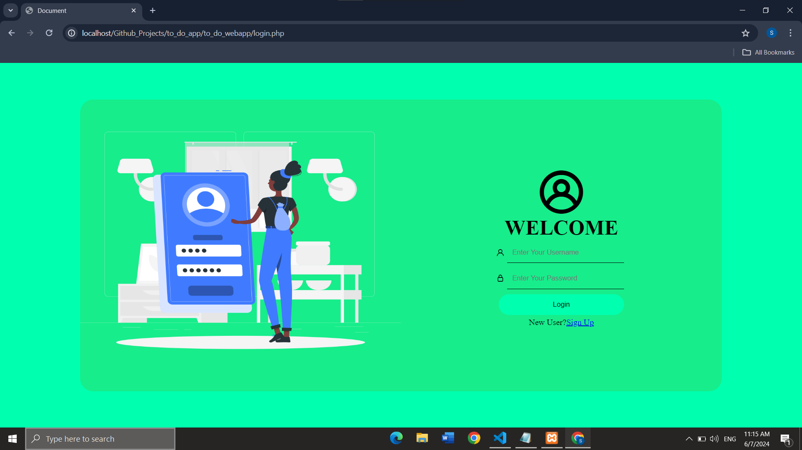
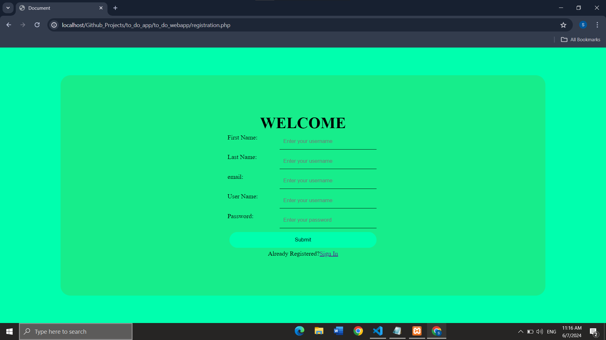
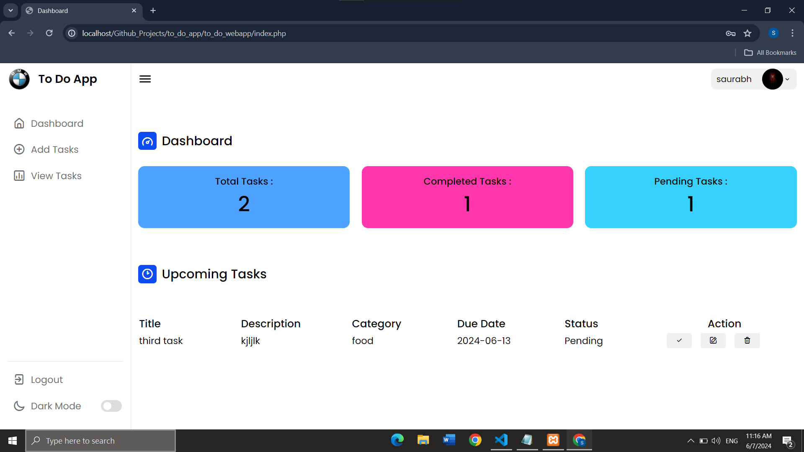
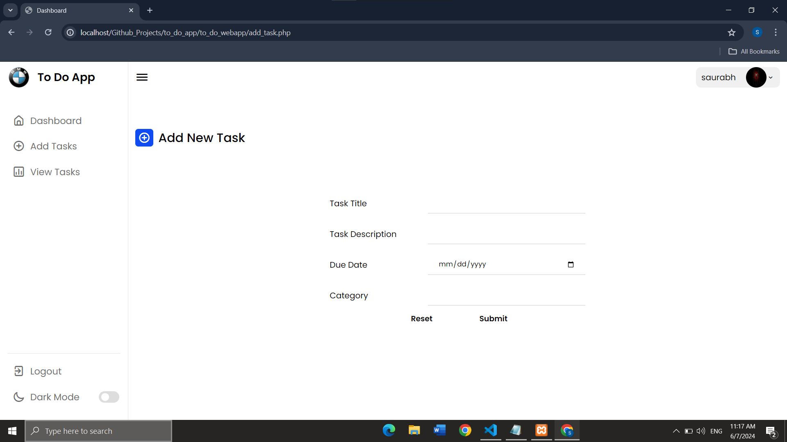
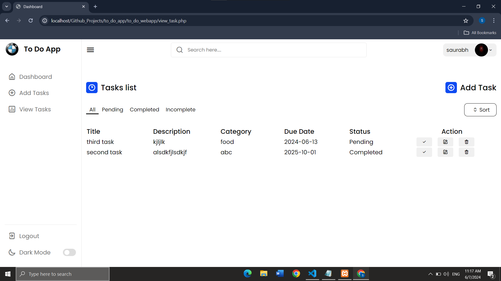
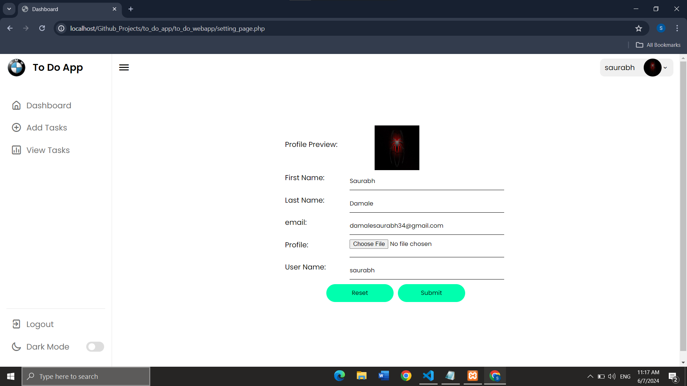

# To-Do App (Laravel)

## Overview

The To-Do App (Laravel) is a simple web-based application developed using PHP Laravel Framework, MySQL, HTML, CSS, and JavaScript, jQuery and Ajax. It helps users manage their tasks and stay organized by providing features such as task creation, updating, deletion, deadline setting, and task prioritization. This app is suitable for personal use or team collaboration, providing an efficient way to track tasks and increase productivity.

## Features

- **Task Management:** Allows users to create, update, and delete tasks easily.
- **Deadline Setting:** Enables users to set deadlines for tasks to prioritize and manage time effectively.
- **Task Prioritization:** Provides options to prioritize tasks based on importance or urgency.
- **Task Categories:** Allows users to categorize tasks into different categories or projects for better organization.
- **Task Status:** Provides status indicators to track the progress of tasks, such as "Completed," "Incompleted," and "Pending."
- **User Authentication:** Supports user authentication to ensure data privacy and security.
- **Responsive Design:** Adapts to different screen sizes for seamless usage on various devices.

## Technologies Used

- **PHP (Laravel):** A powerful backend framework based on PHP for building web applications with an expressive and elegant syntax, supporting MVC architecture and offering features like routing, authentication, and database management.
- **MySQL:** A widely-used relational database management system (RDBMS) for efficient data storage, retrieval, and management, providing a robust environment for structured data handling.
- **HTML/CSS:** Standard frontend languages; HTML defines the structure of the web app while CSS provides the design and layout, ensuring the app is visually appealing and responsive across different devices.
- **JavaScript:** A versatile frontend scripting language used to create dynamic and interactive elements, enabling features like form validation, animations, and real-time updates in the application interface.

## Usage

Follow these steps to set up and run the To-Do App (Laravel) locally:

1. **Clone the Repository:**
   - Clone the repository to your local machine using the following command:
     ```
     https://github.com/HackRoot1/laravel-to-do-webapp.git
     ```

2. **Install Dependencies:**
   - Navigate to the project directory and install the required dependencies using Composer:
     ```
     cd laravel-to-do-webapp
     composer install
     ```

3. **Set Up Environment Variables:**
   - Copy the `.env.example` file to create your `.env` file:
     ```
     cp .env.example .env
     ```
   - Open the `.env` file and update the database connection details (DB_HOST, DB_PORT, DB_DATABASE, DB_USERNAME, DB_PASSWORD) according to your MySQL configuration.

4. **Generate Application Key:**
   - Generate the Laravel application key, which is used for encryption and session management:
     ```
     php artisan key:generate
     ```

5. **Run Database Migrations:**
   - Run the following command to set up the database tables:
     ```
     php artisan migrate
     ```

6. **Seed the Database (Optional):**
   - You can seed the database with initial data using:
     ```
     php artisan db:seed
     ```

7. **Start a Local Development Server:**
   - Use the Laravel built-in server to run the application:
     ```
     php artisan serve
     ```

8. **Access the App:**
   - Open a web browser and navigate to `http://localhost:8000` to access the To-Do App (Laravel).
  

## Project Structure

- **index.php:** The main entry point of the application.
- **config.php:** Configuration file for database connection and other settings.
- **/assets:** Directory for storing CSS stylesheets, JavaScript, images files.
- **/includes:** Directory for PHP include files containing reusable code and functions.
- **/uploads:** Directory for uploading and storing files or documents related to tasks.

## Demo Screenshots


*Login Page: User Login Page*


*Registration Page: User can register*


*User Dashboard: View and Manage upcomming Tasks*


*Add Tasks: Add new Tasks*


*View Tasks: View and manage all tasks*


*Profile Page: View and manage Profile Settings*


## Contributing

If you'd like to contribute to the project, feel free to fork the repository, make changes, and submit a pull request. Your feedback, suggestions, and contributions are highly appreciated and will help improve the app further.
